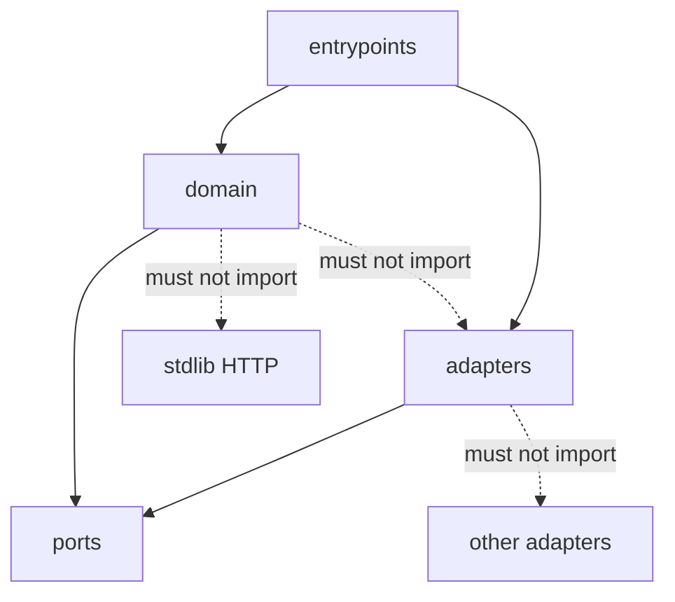
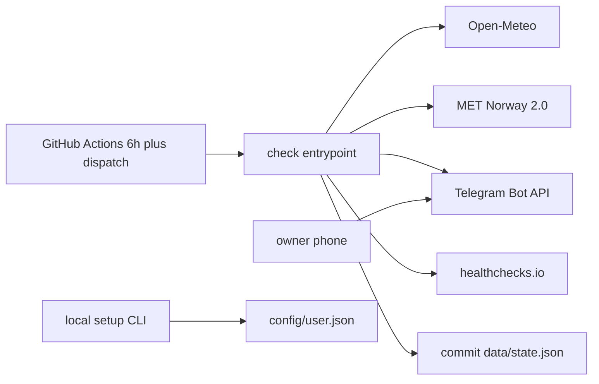

# Architecture Spine — Frost Alert

## Design Paradigm

Ports and adapters. Domain owns classification, remaining-time windows, and season (`monitoring` | `suspended`). Ports: ForecastSource, Notifier, AckInbox, Watchdog, ConfigStore, StateStore, Clock. No framework.



## Invariants & Rules

### AD-1 — Ports and adapters

- **Binds:** all
- **Prevents:** setup, check, and Telegram poll each inventing their own classification or season rules
- **Rule:** Domain contains no I/O. Adapters implement ports. Entrypoints only wire. Adding a vendor means a new adapter, not a new domain.

### AD-2 — Python 3.13 + uv + stdlib HTTP

- **Binds:** all
- **Prevents:** a second runtime or a web server the spec rejected
- **Rule:** Runtime is CPython 3.13 (`.python-version` and `actions/setup-python@v7`; patch floats). Tooling is uv. HTTP uses the stdlib. No `requests`/`httpx` unless a later port cannot work without them. No web framework.

### AD-3 — Config and state are committed files

- **Binds:** CAP-1, CAP-4, CAP-5
- **Prevents:** cache/artifact stores that die over a seasonal idle; secrets in git; two agents inventing two stores
- **Rule:** `config/user.json` is written only by setup; keys exactly `place_name` (string), `lat`/`lon` (float), `elevation_m` (number), `timezone` (IANA), `threshold_c` (number), `scale` (`C`|`F`). Place, elevation, and timezone come from the geocoder, not guessed. `data/state.json` keys exactly `season` (`monitoring`|`suspended`), `event_date` (`YYYY-MM-DD` or `null`), `alerted_windows` (array of ints from 24/12/6 for the current `event_date`), `telegram_offset` (int, last processed `update_id`, `0` if none), `updated_at` (UTC ISO-8601). Only StateStore writes state, and only the check entrypoint calls it. Secrets stay in GitHub Secrets under `TELEGRAM_BOT_TOKEN`, `TELEGRAM_CHAT_ID`, `HEALTHCHECKS_PING_URL`. Do not use Actions cache or artifacts as the store. Setup geocodes once (city, postal code, or optional coordinates); scheduled checks never re-geocode.

### AD-4 — Single writer per tick

- **Binds:** CAP-2, CAP-3, CAP-4, CAP-7
- **Prevents:** two jobs committing `data/state.json` and losing an in/out flip
- **Rule:** One workflow (`.github/workflows/check.yml`) per tick: classify → maybe alert → poll Telegram → write state once. Setup is a local CLI, never a concurrent writer. `concurrency`: one in-flight run, cancel-in-progress.

### AD-5 — Remaining time, not cron name

- **Binds:** CAP-2, CAP-3
- **Prevents:** a late GitHub Action sending the wrong 24h/12h/6h step
- **Rule:** Lead time is `first_at_or_below − Clock.now`. A crossing counts if `0 < remaining ≤ 30h`. Mapping: remaining > 12h → window 24; remaining > 6h → window 12; remaining > 0 → window 6. Already-alerted is keyed by frost event + window, not the job name. Each window sends at most once per event. "Keep alerting until /in" means new events, not re-sending a window every tick.

### AD-6 — Ping after a successful check

- **Binds:** CAP-7
- **Prevents:** a crash or dual-API miss looking healthy; a Telegram outage looking like a missed job
- **Rule:** Watchdog pings only after a forecast series was obtained (primary or fallback) and classification finished. Dual-API miss or crash: no ping, non-zero exit. Notifier failure still pings.

### AD-7 — Any upcoming hour, Celsius on disk

- **Binds:** CAP-2, CAP-3
- **Prevents:** missing a daytime drop; comparing a °F threshold to Celsius hours
- **Rule:** Risk is any **forecast** hour at or below `threshold_c`. Never read live current temperature. Domain and both JSON files store Celsius. `scale` is setup and display only; setup converts °F → `threshold_c`. Setup default `threshold_c` is 3.

### AD-8 — One event per local date until /in

- **Binds:** CAP-3, CAP-4
- **Prevents:** a cold snap going silent after the first 6h while plants are still out
- **Rule:** Frost event = local calendar date (config IANA zone) of the first upcoming hour at or below `threshold_c`. Same-day forecast revision does not reset windows. When that date ends, the next crossing is a new event. Monitoring keeps evaluating every tick until `/in`; Suspended: job still runs, no frost alerts.

### AD-9 — Telegram is the season flip

- **Binds:** CAP-4
- **Prevents:** laptop-only resume; nightly snooze; editing `state.json` by hand
- **Rule:** Only domain assigns `season`. Adapters report intents; they do not write `state.json`. `/in` or `plants_in` → `suspended` (event/windows unchanged). `/out` or `plants_out` → `monitoring` and clear `event_date` + `alerted_windows` so a same-day resume can warn again. Repeat commands are idempotent. Ignore updates whose chat id is not `TELEGRAM_CHAT_ID`. Intake is cron-polled `getUpdates` with `offset = telegram_offset + 1` — a webhook must not be set. Telegram drops updates older than 24h. Always `answerCallbackQuery`. CLI is setup only (CAP-1), not the season flip. Domain has no snooze-until-tomorrow state.

### AD-10 — Six-hour tick and watchdog window

- **Binds:** CAP-5, CAP-7
- **Prevents:** hourly overlapping writers; a 12h cadence missing the 6h window or a same-afternoon resume
- **Rule:** Schedule every 6 hours. `workflow_dispatch` stays on. healthchecks.io period 6h, grace ~6h — document beside the ping-URL secret, do not hardcode. Leave GitHub Actions' built-in workflow-failure email on as the $0 failure channel beside the watchdog.

### AD-11 — Availability failover only

- **Binds:** CAP-6
- **Prevents:** blending two vendors as a second opinion; treating bad coordinates as an outage
- **Rule:** Open-Meteo first, 15s timeout. MET Norway on timeout, connect error, 5xx, 429, or empty/malformed hourly data. No fallback on 4xx-bad-request. MET Norway: `locationforecast/2.0/compact`, `altitude` = `elevation_m`, lat/lon 4 decimals, identifying User-Agent (`Frost-alert` plus repo URL). Domain sees one series: an ascending list of objects with UTC ISO-8601 `t` and Celsius `temp_c`. Adapters convert vendor JSON (Open-Meteo must not pass GMT hours through as local). Missing, unsorted, or non-hourly data is malformed → failover. Both fail: AD-6 no-ping path.

### AD-12 — Package layout

- **Binds:** all
- **Prevents:** a script pile that copies classification into each job
- **Rule:** Code lives under `src/frost_alert/{domain,ports,adapters,entrypoints}`. Unit tests use fake ports; no live network.

### AD-13 — Tick order and persist

- **Binds:** CAP-2, CAP-3, CAP-4, CAP-5, CAP-7
- **Prevents:** marking a window before send; pinging after a lost state commit; two units owning the git write
- **Rule:** One tick, this order: load config+state → if `monitoring`, fetch+classify → send frost alert only if that window is not in `alerted_windows` and mark it only after a successful send → poll Telegram and apply domain in/out → StateStore write → `git` commit `data/state.json` with `permissions: contents: write` → watchdog ping. Monitoring dual-API miss: stop before ping. Suspended: skip forecast, still poll/write/commit/ping. Notifier failure: do not mark the window; still ping if classification succeeded.

## Consistency Conventions

| Concern | Convention |
| --- | --- |
| Naming | Package `frost_alert`. Commands `/in` `/out`. Callback data `plants_in` `plants_out`. |
| Data & formats | JSON. Instants UTC ISO-8601. Event key local `YYYY-MM-DD`. Config keys: `place_name`, `lat`, `lon`, `elevation_m`, `timezone`, `threshold_c`, `scale` (`C`\|`F`). State keys: `season` (`monitoring`\|`suspended`), `event_date`, `alerted_windows`, `telegram_offset`, `updated_at`. |
| State & cross-cutting | Logs to stdout. Secrets: bot token, chat id, watchdog ping URL — GitHub Secrets only. |
| Frost alert copy | Notifier follows `alert-copy.md`: preview is one-glance (emoji, risk, 24h/12h/6h), no table/location/ack how-to; opened message adds place, first-crossing temp in user scale, when, threshold, ack control. Exact strings stay unlocked. Watchdog-miss copy is not a frost alert. |
| Operator docs | README must say: whitelist Telegram from Android battery optimization. |

## Stack

| Name | Version |
| --- | --- |
| CPython | 3.13 |
| uv | 0.12 |
| actions/checkout | v7 |
| actions/setup-python | v7 |
| GitHub-hosted runner | ubuntu-latest |
| Open-Meteo Forecast API | public no-key 2026-09 |
| Open-Meteo Geocoding API | public no-key 2026-09 |
| MET Norway Locationforecast | 2.0 |
| Telegram Bot API | 10.3 |
| healthchecks.io | ping API 2026-09 |

## Structural Seed

```text
src/frost_alert/
  domain/
  ports/
  adapters/
  entrypoints/     # setup CLI, check (GHA job)
config/user.json   # setup writes; user commits
data/state.json    # StateStore writes; workflow commits
.github/workflows/check.yml
.python-version    # 3.13
```



Default-branch schedule only. Public repo on GitHub Free (or Pro if private). No personal always-on host. v1 host is GitHub Actions only.

## Capability → Architecture Map

| Capability / Area | Lives in | Governed by |
| --- | --- | --- |
| CAP-1 setup location, scale, threshold | `entrypoints` setup + ConfigStore | AD-2, AD-3, AD-7, AD-12 |
| CAP-2 detect threshold crossing | `domain` + ForecastSource | AD-5, AD-7, AD-8, AD-11 |
| CAP-3 escalating alerts | `domain` + Notifier | AD-5, AD-8, AD-13, alert-copy.md |
| CAP-4 plants in/out | AckInbox + domain season | AD-8, AD-9, AD-13 |
| CAP-5 unattended schedule | `check.yml` | AD-4, AD-10, AD-13 |
| CAP-6 forecast fallback | ForecastSource adapters | AD-11 |
| CAP-7 missed-job warning | Watchdog adapter | AD-6, AD-10, AD-13 |

## Deferred

- Exact frost-alert sentences — `alert-copy.md` owns preview vs opened split; strings stay unlocked.
- Extra pytest plugins and fixture libraries — `pytest` plus fakes is enough.
- Wording of the `data/state.json` commit message.
- ntfy, email, and Pushover — not required for v1 success.
- Open-Meteo `models=` pin — spec already forbids a Sweden-only pin.
- AWS EventBridge Scheduler + Lambda — documented non-default host in `stack.md`, not built in v1.
