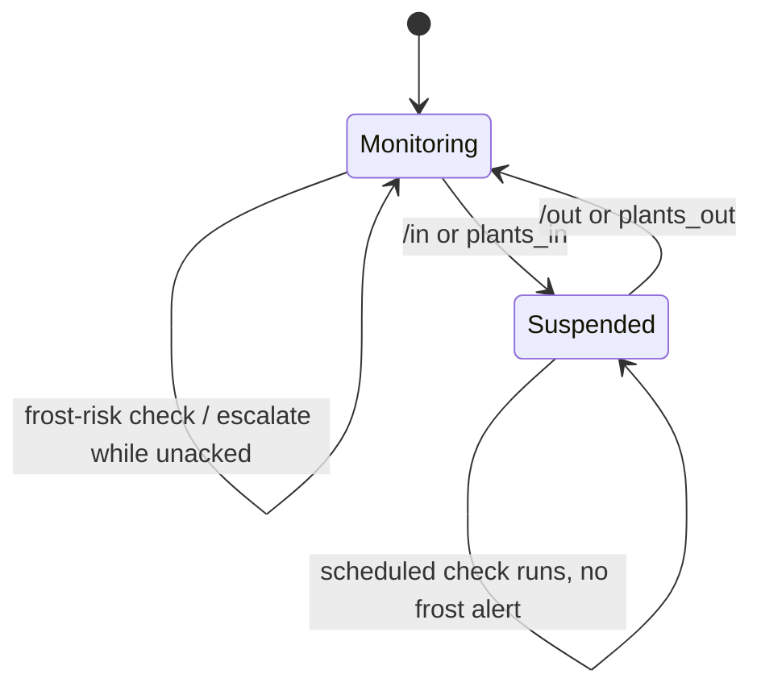
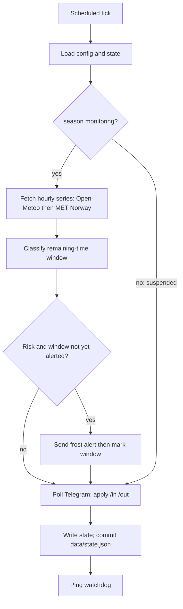

# State machines

Window mapping, tick order, and persist rules are also on the adopted architecture spine (AD-5, AD-8, AD-9, AD-13).

## Seasonal monitoring

- **Monitoring:** CAP-2/CAP-3/CAP-6/CAP-7 apply. Frost alerts may fire. Job keeps classifying until `/in`.
- **Suspended:** frost alerts are off. Job still runs: skip forecast, still poll Telegram, write state, ping watchdog. A missed check is not a frost alert.
- Ack is seasonal, not a per-night snooze. There is no "snoozed until tomorrow" state. In/out may repeat in one autumn; each flip is an explicit Telegram action.
- `/out` clears `event_date` and `alerted_windows` so a same-day resume can warn again. Repeat commands are idempotent.

## Check and escalate (one tick)

- Lead time is `first_at_or_below − now`. A crossing counts if `0 < remaining ≤ 30h`.
- Mapping: remaining > 12h → window 24; remaining > 6h → window 12; remaining > 0 → window 6.
- Already-alerted is keyed by frost event (local calendar date of the first at-or-below hour) + window, not the job name. Same-day forecast revision does not reset windows. When that date ends, the next crossing is a new event.
- Mark a window only after a successful send. Notifier failure: do not mark; still ping if classification succeeded.
- Dual-API miss while monitoring: stop before ping, non-zero exit.
- Suspended: skip forecast, still poll/write/commit/ping.
- Cadence is 24h → 12h → 6h. No further steps.
- The 24h check is a coarse early warning. Shorter windows increase chance of notice under scheduler delay; they do not claim a more accurate low.
